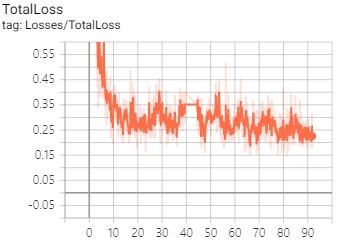
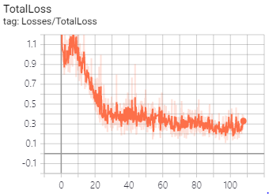
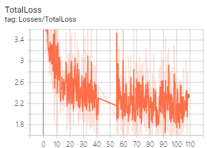
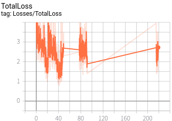

# Light_Detect
University &amp; Industry cowork project (Team VAR &amp; Alchera Inc.)
Estimate the light source from a single image.

Our project is divided into Client(HoloLens), Server(PC), and Machine Learning(Neural Network Model, Inference) parts.
- Part1. Client: https://github.com/sshan10/AR_Rendering
- Part2. Server: https://github.com/yuriver/ServerForHololens
- Part3. ML: https://github.com/MJ-Kim/Light_Detect/

# Demonstration video
https://www.youtube.com/watch?v=I9PtK627iCI

# Team_VAR
- Yuriver 
  - unity client development
  - network development
  
- sshan10
  - unity client development
  - graphic optimization
  
- Kim.MJ
  - mahchine learning
  - computer vision development

# License  
## Tensorflow
&nbsp;&nbsp;&nbsp;&nbsp;&nbsp;&nbsp;https://github.com/tensorflow/tensorflow  
&nbsp;&nbsp;&nbsp;&nbsp;&nbsp;&nbsp;Apache 2.0 License  

## python-opencv
&nbsp;&nbsp;&nbsp;&nbsp;&nbsp;&nbsp;https://github.com/skvark/opencv-python  
&nbsp;&nbsp;&nbsp;&nbsp;&nbsp;&nbsp;MIT License 

 
 

Apache License 2.0

Copyright 2019 VAR

Licensed under the Apache License, Version 2.0 (the "License");
you may not use this file except in compliance with the License.
You may obtain a copy of the License at
http://www.apache.org/licenses/LICENSE-2.0
Unless required by applicable law or agreed to in writing, software
distributed under the License is distributed on an "AS IS" BASIS,
WITHOUT WARRANTIES OR CONDITIONS OF ANY KIND, either express or implied.
See the License for the specific language governing permissions andlimitations under the License.  

 
 

MIT License

Permission is hereby granted, free of charge, to any person obtaining a copy of this software and associated documentation files (the "Software"), to deal in the Software without restriction, including without limitation the rights to use, copy, modify, merge, publish, distribute, sublicense, and/or sell copies of the Software, and to permit persons to whom the Software is furnished to do so, subject to the following conditions:
 9
 
# Graph list
- faster_rcnn_resnet101

- faster_rcnn_inception_resnet_v2

- ssd_mobilenet_v2

- ssd_inception_v2

